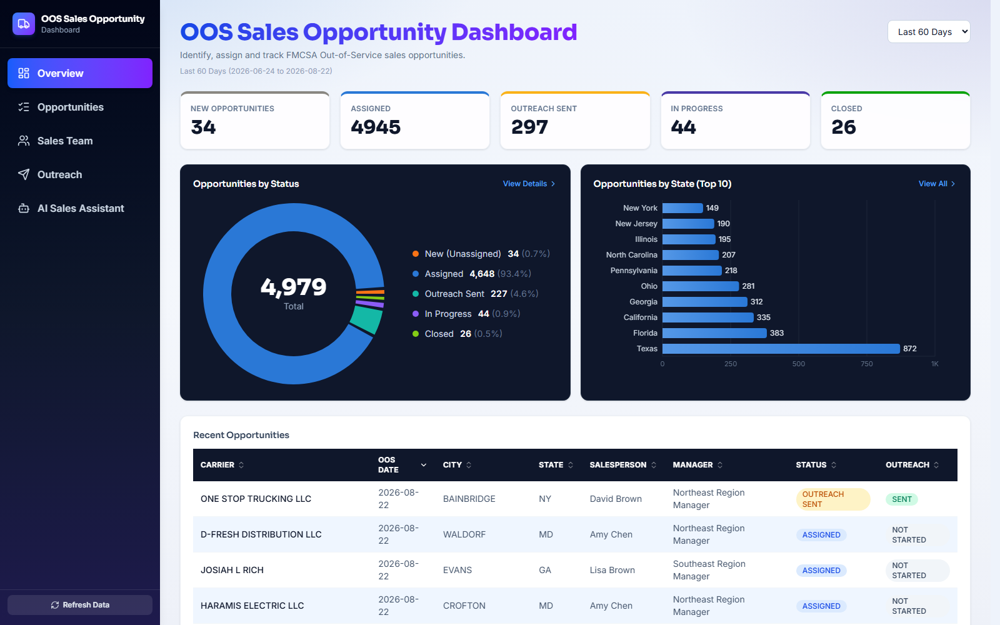
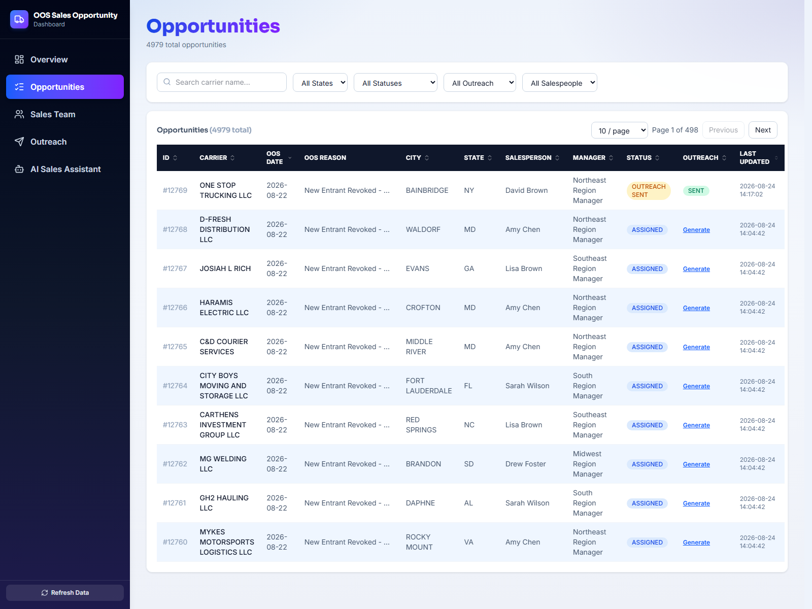
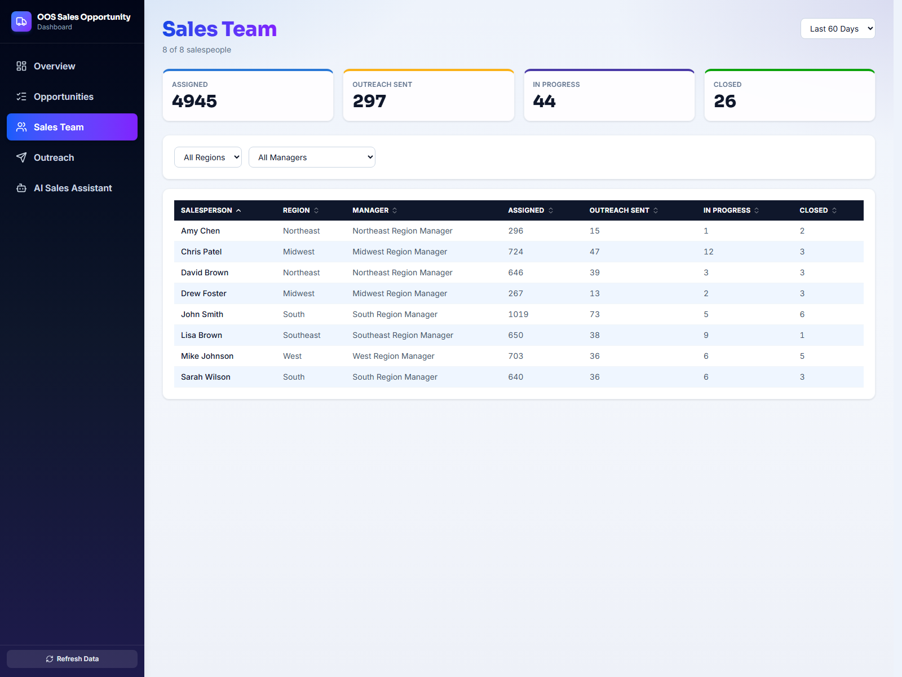
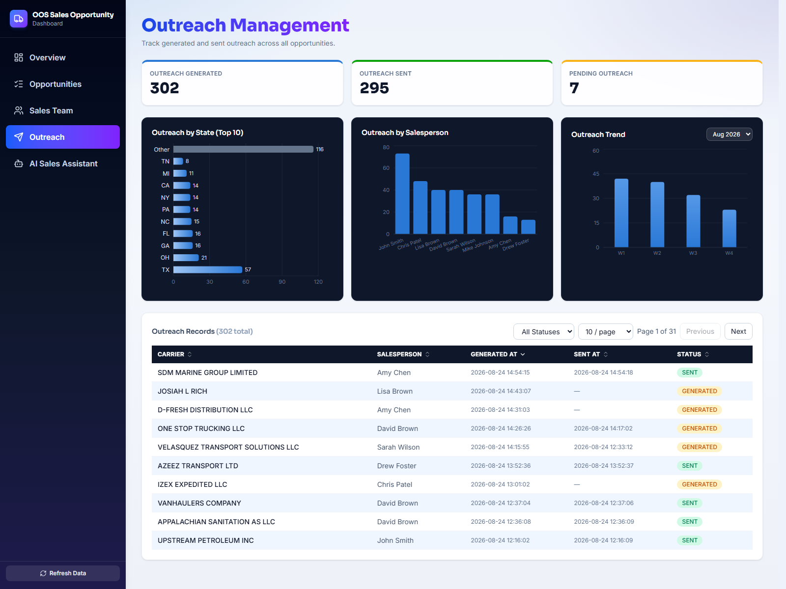
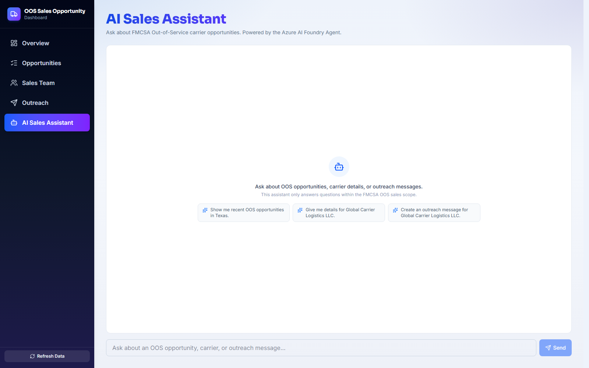
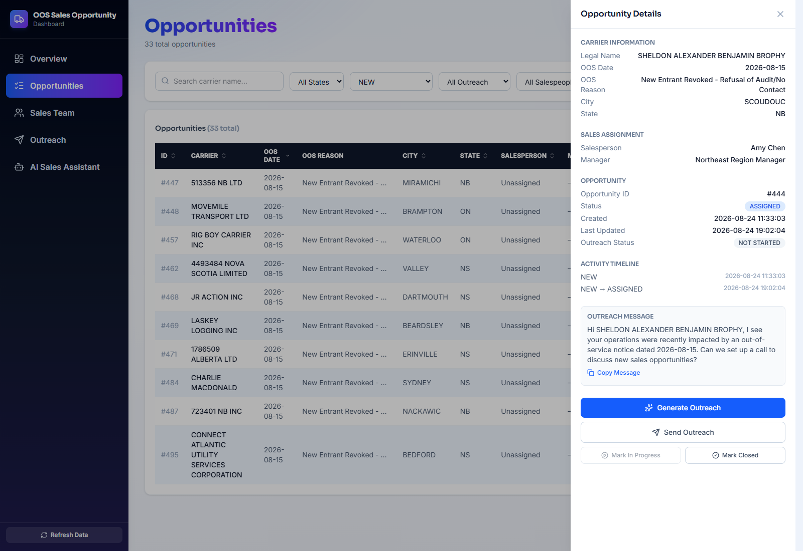
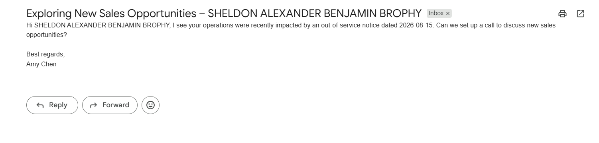

# OOS Sales Opportunity Dashboard

A full-stack prototype that turns FMCSA Out-of-Service (OOS) carrier data into a
working sales opportunity pipeline: enrich → assign → generate outreach → track,
plus an AI assistant grounded on the live data via an Azure AI Foundry agent.

> Currently runs locally (see **Running locally** below) — screenshots below are
> from a live local run against the real SQLite dataset.

## Screenshots

**Overview** — status donut, state breakdown, recent opportunities, 30/60/90-day window


**Opportunities** — sortable, filterable, paginated full opportunity list


**Sales Team** — per-rep KPIs and portfolio, filterable by region/manager


**Outreach Management** — generated/sent/pending KPIs, by-state and by-salesperson charts, monthly trend drill-down


**AI Sales Assistant** — chat grounded on the live data via an Azure AI Foundry agent


**Opportunity workflow** — assign a salesperson, then generate outreach via the Foundry agent


**Real outreach email** — actually delivered by the Send Outreach action (sender address cropped)


## Architecture

- **Backend** — FastAPI + SQLite (`backend/`). Raw `sqlite3` repository layer,
  routers per domain (`overview`, `opportunities`, `sales_team`, `outreach`,
  `assistant`, `refresh`).
- **Frontend** — React + TypeScript + Vite (`frontend/`), Tailwind CSS, Recharts.
- **AI Assistant** — calls an Azure AI Foundry agent (built in the sibling
  [`AzureFoundry`](../AzureFoundry) project) grounded on an Azure AI Search index
  of the OOS/MCMIS data, so answers cite real carrier records instead of
  hallucinating.
- **Data refresh** — a manual "Refresh Data" action pulls live FMCSA OOS +
  MCMIS Census data, enriches new carriers, inserts them into SQLite, and syncs
  the new records into the Azure AI Search index so the assistant stays current.
- **`src/`** — an earlier Streamlit-based prototype of the same idea, kept for
  reference; superseded by the FastAPI + React app in `backend/`/`frontend/`.

## Features

- **Overview** — KPI cards, opportunities-by-status donut, opportunities-by-state
  chart, recent opportunities table, all scoped to a 30/60/90-day window.
- **Opportunities** — full sortable/paginated/filterable list (state, status,
  outreach status, salesperson, search), carrier detail drawer, one-click
  outreach generation.
- **Sales Team** — per-salesperson KPIs and opportunity portfolio, filterable by
  region/manager, reconciled to the same date window as Overview.
- **Outreach Management** — generated/sent/pending KPIs, outreach-by-state and
  by-salesperson charts, a month-picker outreach trend chart, and a sortable
  outreach records table.
- **AI Sales Assistant** — chat interface backed by the Foundry agent, scoped to
  FMCSA OOS sales questions.

## Running locally

### Backend

```bash
cd backend
python -m venv venv
venv\Scripts\activate        # Windows; use `source venv/bin/activate` on macOS/Linux
pip install -r requirements.txt
cp .env.example .env         # fill in SMTP settings for outreach emails
uvicorn app.main:app --reload --port 8700
```

The AI Assistant and Refresh features additionally depend on Azure AI Foundry
project + Azure AI Search credentials, which are loaded from the sibling
`AzureFoundry` project's `.env` — see `backend/app/services/foundry_service.py`
and `backend/app/services/refresh_service.py`. Without that project present,
every other part of the dashboard (Overview, Opportunities, Sales Team,
Outreach) still works against the local SQLite database.

### Frontend

```bash
cd frontend
npm install
npm run dev
```

The frontend expects the backend at `http://localhost:8700` (see
`frontend/src/api/client.ts`).

## Data

`backend/scripts/init_db.py` loads FMCSA Out-of-Service data enriched with
location fields from the FMCSA MCMIS Company Census API — both public
government data sources. The enriched CSV itself lives in the sibling
`AzureFoundry` project, not in this repo.
